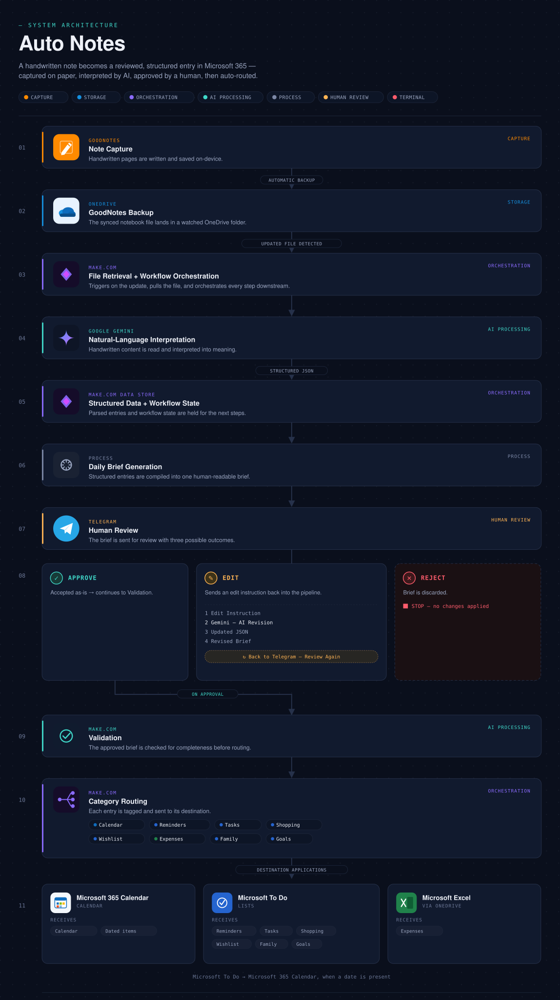
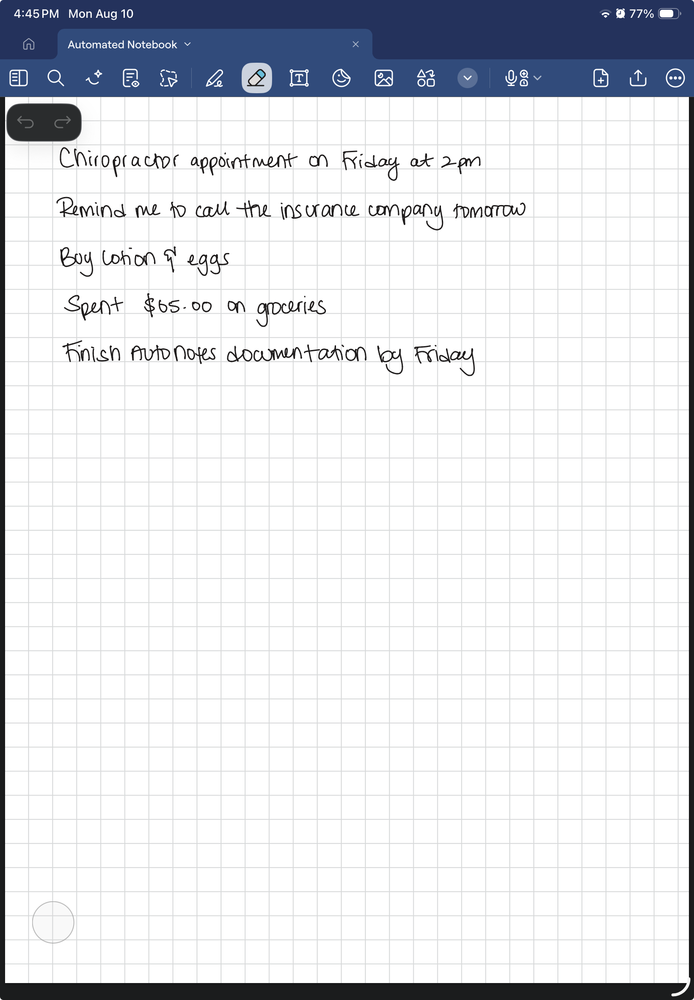
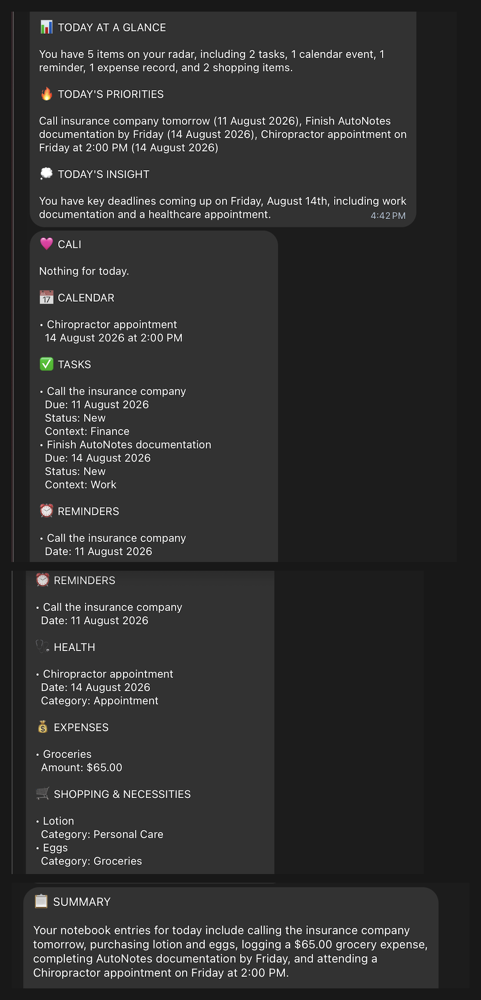
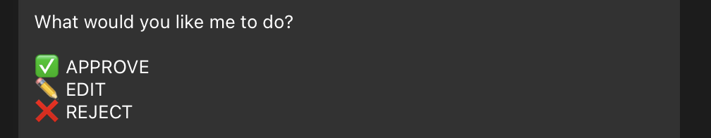
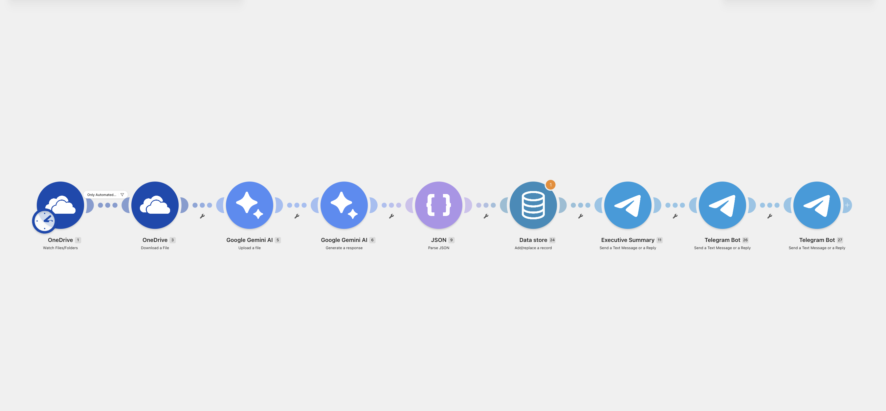
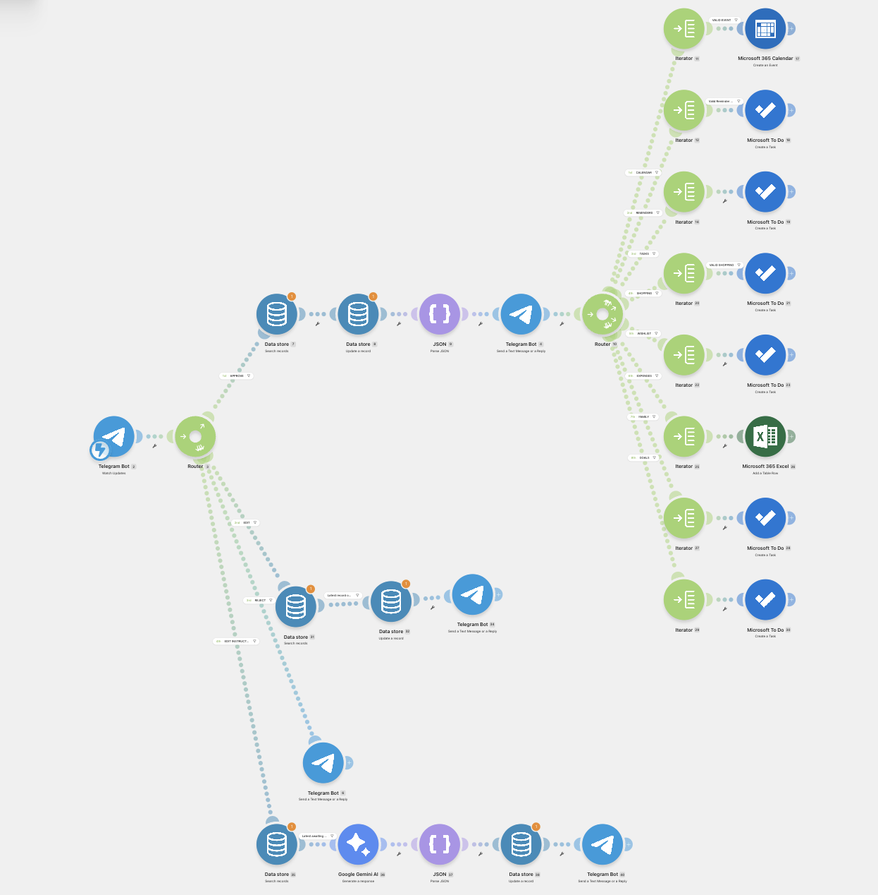
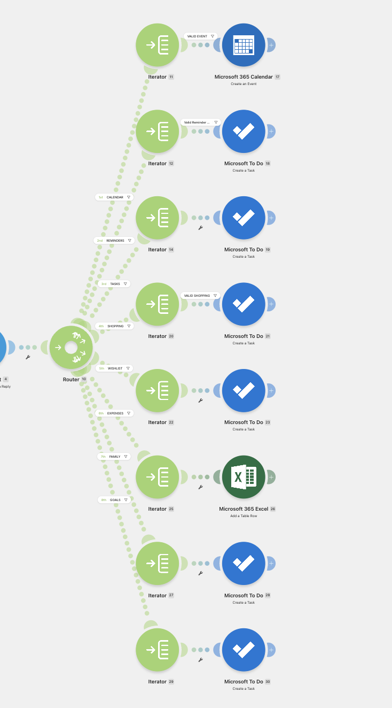

# AutoNotes

### AI-Powered Note-to-Action Automation

> Write it once. Let automation organize the rest.

## About the Project

I love writing things down, but I don't love having to organize the same information again across multiple apps.

I use Goodnotes as my primary note-taking application. My notebook is automatically backed up to OneDrive, which gives AutoNotes access to the latest version of my notes without requiring me to manually export or upload them each time.

An appointment written in my notes still needs to be added to my calendar. Something I need to buy still needs to be added to my shopping list. A reminder still needs to be created somewhere else.

I built **AutoNotes** to eliminate that duplicate work.

AutoNotes monitors the Goodnotes backup stored in OneDrive, retrieves the updated note file, and uses AI to interpret its contents. Actionable information is converted into structured data and prepared for the appropriate productivity application.

Before anything is created, the system sends me a Daily Brief through Telegram where I can **Approve, Edit, or Reject** the proposed actions.

The idea is simple:

**Write in Goodnotes → Automatic OneDrive backup → AI interprets → I review → Automation executes.**

---

## The Problem

My note-taking system is where I capture information throughout the day, including:

- Appointments
- Reminders
- Tasks
- Shopping items
- Family responsibilities
- Goals
- Expenses
- Other information I want to remember

The problem wasn't capturing information.

The problem was everything that had to happen **after** I captured it.

If I wrote an appointment in Goodnotes, I still had to manually create the calendar event.

If I wrote something I needed to buy, I still had to add it to my shopping list.

If I wrote down something I needed to remember, I still had to create the appropriate reminder or task.

I was essentially recording the same information twice.

AutoNotes started with a question:

> **What if writing something down once was enough?**

---

## Project Objectives

I designed AutoNotes to:

- Allow me to continue taking notes naturally in Goodnotes
- Use the existing Goodnotes backup in OneDrive as the source for automation
- Detect updated note files without requiring a manual upload
- Use AI to understand the intent behind naturally written notes
- Convert unstructured information into structured JSON
- Categorize actionable information
- Generate a human-readable Daily Brief
- Require approval before executing actions
- Allow natural-language corrections
- Validate information before sending it to external applications
- Route approved information to the appropriate destination
- Maintain workflow state between Telegram interactions
- Reduce repetitive manual data entry

Duplicate prevention is also being developed to prevent previously processed information from being recreated.

---

## How It Works

AutoNotes follows a human-in-the-loop automation model.

```text
Goodnotes
     │
     ▼
Automatic OneDrive Backup
     │
     ▼
Detect Updated Note File
     │
     ▼
Retrieve File
     │
     ▼
AI Interpretation
     │
     ▼
Structured JSON
     │
     ▼
Daily Brief
     │
     ▼
Telegram Review
     │
     ├──── APPROVE ────► Validation ────► Application Routing
     │
     ├──── EDIT ───────► AI Revision ───► Revised Daily Brief
     │
     └──── REJECT ─────► Stop
```

This architecture allows Goodnotes to remain my primary note-taking environment while OneDrive acts as the bridge between my notes and the automation workflow.

---

## System Architecture

AutoNotes uses a multi-stage architecture that connects note capture, AI interpretation, human review, validation, and action execution.



The workflow begins in Goodnotes, where notes are automatically backed up to OneDrive. Make.com detects the updated backup file and retrieves it for processing. Google Gemini interprets the natural-language content and converts actionable information into structured data.

The structured data and workflow state are maintained using Make.com Data Stores before a human-readable Daily Brief is generated and sent to Telegram.

Telegram acts as the human-in-the-loop control layer. Proposed actions can be **approved, edited, or rejected** before anything is created in an external application. Edit requests are returned to Gemini for revision and sent back to Telegram for another review.

Once approved, each item is validated and routed according to its category:

- **Calendar** → Microsoft 365 Calendar
- **Reminders, Tasks, Shopping, Wishlist, Family, and Goals** → Microsoft To Do
- **Expenses** → Microsoft Excel / OneDrive

This separation allows AI to handle interpretation while deterministic workflow logic controls validation, routing, and execution.


---

## Example Workflow

The following example demonstrates how AutoNotes transforms an unstructured handwritten note into organized, actionable information while keeping the user in control before any actions are executed.

### 1. Handwritten Input

The process begins with a handwritten note in Goodnotes. The user can write naturally without manually separating information into different applications or categories.



### 2. AI-Generated Daily Brief

After the Goodnotes backup is updated in OneDrive, the workflow retrieves the note and uses Google Gemini to interpret the content.

The system identifies actionable information, determines relevant dates and context, categorizes the entries, and generates a structured Daily Brief for review in Telegram.



In this example, the handwritten entries were interpreted as calendar, task, reminder, shopping, health, and expense information.

### 3. Human Approval

Before any approved information is routed to connected applications, AutoNotes presents a human-in-the-loop approval checkpoint.



The user can:

- **Approve** — continue to validation and application routing.
- **Edit** — provide an edit instruction and receive a revised Daily Brief for another review.
- **Reject** — stop the workflow without executing the proposed actions.

This design keeps AI responsible for interpretation while the user retains control over execution.

> **Demo note:** This example intentionally stops at the approval stage so test data is not written to the connected production applications.
---

## Workflow Overview

AutoNotes currently operates through two connected automation scenarios.

### Scenario 1 — Note Processing

The first scenario connects my Goodnotes note-taking workflow to AutoNotes.

Goodnotes automatically backs up my notebook to OneDrive. AutoNotes monitors the designated OneDrive location for updates and retrieves the latest backed-up note file when a change is detected.

The file is then passed to Google Gemini for interpretation. Gemini identifies actionable information and converts the unstructured note content into structured data.

The response is parsed as JSON, stored for later processing, and transformed into a human-readable Daily Brief.

The Daily Brief is then delivered through Telegram for review before any external actions are created.



### Scenario 2 — Approval & Execution

The second scenario manages the interactive approval and execution process.

Telegram responses are evaluated and routed through the appropriate **Approve, Edit, or Reject** path.

Approved information continues through validation and application routing.

Edit requests enter a separate revision workflow where the requested changes are interpreted and applied before an updated Daily Brief is returned for another review.

Rejected information is prevented from continuing through the workflow.



### Application Routing

Once information is approved, the structured data is separated into its respective categories.

Each category passes through its own iteration and validation logic before reaching the appropriate destination application.



---

## Technologies Used

| Technology | Role in AutoNotes |
|---|---|
| **Goodnotes** | Captures handwritten notes and automatically backs up notebook files |
| **Microsoft OneDrive** | Stores the Goodnotes backup and provides the source file monitored by the workflow |
| **Make.com** | Orchestrates the automation, manages workflow logic, validation, routing, and application actions |
| **Google Gemini** | Interprets natural-language note content and converts it into structured data |
| **JSON** | Provides the structured data format used between AI interpretation and workflow processing |
| **Make.com Data Store** | Maintains structured data and workflow state throughout the review process |
| **Telegram Bot** | Delivers the Daily Brief and provides the human review interface |
| **Microsoft 365 Calendar** | Receives approved calendar events |
| **Microsoft To Do** | Receives approved reminders, tasks, shopping, wishlist, family, and goal items |
| **Microsoft Excel** | Records approved expense information |
## Key Features

- Natural-language interpretation of handwritten notes
- Automated processing of Goodnotes backups from OneDrive
- AI-powered categorization of unstructured information
- Structured JSON generation for downstream workflow processing
- Automatically generated Daily Brief
- Human-in-the-loop approval before action execution
- Approve, edit, and reject workflow controls
- AI-assisted revision of user-requested edits
- Persistent workflow state using Make.com Data Stores
- Category-specific validation and routing
- Automated creation of calendar events, tasks, reminders, shopping items, wishlist items, family items, goals, and expense records
- Separation of AI interpretation from deterministic workflow execution

---

## Natural-Language Interpretation

AutoNotes is designed around natural input.

I don't need to manually label or structure information before writing it in Goodnotes.

For example:

| Note | Interpreted Action |
|---|---|
| Buy toothpaste | Shopping item |
| Dentist appointment Friday at 2 PM | Calendar event |
| Remind me to call the school tomorrow | Reminder |
| Finish documentation by Monday | Task |
| Save $5,000 by December | Goal |

Google Gemini acts as the interpretation layer.

Its responsibility is to understand the natural-language input and convert it into predictable structured data that the rest of the workflow can process.

This allows me to focus on capturing information naturally instead of changing the way I take notes to accommodate the automation.

---

## Structured Data

Instead of allowing AI-generated text to directly control downstream applications, AutoNotes converts interpreted information into structured JSON.

Example:

```json
{
  "calendar": [
    {
      "title": "Dentist Appointment",
      "date": "2026-08-14",
      "time": "2:00 PM"
    }
  ],
  "shopping": [
    {
      "item": "Toothpaste"
    }
  ],
  "reminders": [
    {
      "title": "Call the school",
      "date": "2026-08-11"
    }
  ]
}
```

This gives the automation a predictable structure that can be parsed, validated, filtered, and routed.

---

## Human-in-the-Loop Approval

I intentionally designed AutoNotes so that AI interpretation does not automatically result in actions being created.

Before anything reaches an external application, Telegram presents the interpreted information as a Daily Brief.

I can then choose:

### APPROVE

The structured information is validated and routed to the appropriate applications.

### EDIT

The workflow enters an editing state and waits for a natural-language correction.

### REJECT

Processing stops and the proposed actions are not created.

This keeps me in control while still allowing AI to handle the interpretation and organization of unstructured information.

---

## Conversational Editing

The EDIT workflow allows corrections without restarting the entire process.

For example:

> Change the dentist appointment to Friday at 3 PM.

When an edit is requested:

1. The current Daily Brief enters an `awaiting_edit` state.
2. The next relevant Telegram message is captured as an edit instruction.
3. The existing structured JSON and edit instruction are sent to Gemini.
4. Gemini modifies the requested information while preserving unrelated data.
5. The revised structured data replaces the previous version.
6. A new Daily Brief is generated.
7. The revised brief must be reviewed again.

The workflow therefore supports an iterative approval cycle:

**EDIT → Instruction → AI Revision → Review → APPROVE / EDIT / REJECT**

---

## State Management

AutoNotes uses Make.com Data Stores to maintain workflow state across separate Telegram interactions.

Example states include:

- `pending`
- `awaiting_edit`
- `approved`
- `rejected`

State management allows the workflow to determine whether an incoming Telegram message is a new command, an editing instruction, or part of an existing approval process.

This is particularly important because Telegram interactions occur separately from the original note-processing scenario.

---

## Validation

AI interpretation is followed by deterministic workflow validation.

For example, an AI response may technically contain a calendar array while not containing enough information to create a valid calendar event.

AutoNotes therefore validates individual items before they reach their destination modules.

### Calendar Events

- Event title must exist
- Required date information must exist
- Date and time values must be valid before event creation

### Shopping Items

- A valid item must exist before a shopping task is created

### Reminders & Tasks

- Required task information must exist before the item continues through the workflow

Invalid or incomplete items are prevented from continuing through the relevant route.

This separates two important responsibilities:

**AI → Interpret the information**

**Workflow → Validate and execute the action**

---

## Application Routing

After approval and validation, items are routed according to their intended action.

| Information | Destination |
|---|---|
| Calendar events | Microsoft 365 Calendar |
| Tasks | Microsoft To Do |
| Reminders | Microsoft To Do |
| Shopping | Microsoft To Do |
| Goals | Microsoft To Do |
| Family tasks | Microsoft To Do |
| Expenses | Microsoft Excel / OneDrive |

The workflow determines the appropriate destination based on the structured category assigned during AI interpretation.

Not every piece of information needs to leave the original note-taking environment. The workflow is designed to create external actions only when doing so provides value.

---

## Tech Stack

| Technology | Purpose |
|---|---|
| Goodnotes | Primary note-capture interface |
| OneDrive | Automatic Goodnotes backup and source file storage |
| Make.com | Workflow orchestration |
| Google Gemini | Natural-language interpretation and structured output |
| Telegram Bot | Daily Brief delivery, approval and conversational editing |
| Make.com Data Stores | Workflow state and structured-data management |
| Microsoft 365 Calendar | Calendar event creation |
| Microsoft To Do | Tasks, reminders, shopping and goals |
| Microsoft Excel | Expense tracking |
| JSON | Structured data exchange between workflow stages |

---

## Engineering Challenges

### Connecting Goodnotes to the Automation

Goodnotes is where I wanted to continue taking my notes, so the automation needed to work around my existing note-taking process rather than requiring me to move to another application.

I used the automatic Goodnotes backup stored in OneDrive as the bridge between my note-taking environment and the automation.

This allows AutoNotes to access updated note files without requiring a separate manual export or upload each time.

### Conversational State

Telegram messages arrive as separate events.

The workflow therefore needed a way to determine whether a message represented a new command or a continuation of an existing interaction.

I introduced persistent workflow states to distinguish between pending approvals and edit instructions.

### Edit Routing

During testing, edit acknowledgement messages were triggered multiple times because multiple records were allowed through part of the workflow.

I refined the routing and filtering logic to ensure the correct record continued through the edit process.

### AI Output Validation

Structured AI output can contain empty categories or incomplete objects.

Additional validation was introduced at the workflow level so that the existence of a category alone does not trigger an external action.

### Date & Time Handling

Natural-language dates and times must ultimately be converted into formats accepted by destination applications.

The workflow includes transformation logic between AI interpretation and application modules.

### Preventing Data Loss During Editing

Editing needed to change only the requested information without unintentionally modifying unrelated items.

The AI editing instructions therefore require the existing structure to be preserved while applying targeted changes.

---

## Duplicate Prevention

**Status: In Development**

Because the Goodnotes backup can continue to contain information that has already been processed, AutoNotes needs to distinguish between new and previously handled items.

Without duplicate prevention, an existing appointment, reminder, or shopping item could potentially be interpreted again during a later run.

The planned approach uses deterministic item identifiers and a processed-item ledger.

```text
New Item
   │
   ▼
Generate Identifier
   │
   ▼
Previously Processed?
   │
   ├── YES → Skip
   │
   └── NO → Create Action → Store Identifier
```

This feature is currently being implemented and tested.

---

## Project Status

AutoNotes is an active personal project.

### Implemented

- Goodnotes note capture
- Automatic Goodnotes backup through OneDrive
- OneDrive source monitoring
- Automated retrieval of updated note files
- Natural-language note interpretation
- AI-generated structured output
- JSON parsing
- Daily Brief generation
- Telegram integration
- APPROVE workflow
- EDIT workflow
- REJECT workflow
- Conversational editing
- Revised approval cycle
- Data Store state management
- Category routing
- Calendar integration
- Microsoft To Do integration
- Excel expense tracking
- Item-level validation

### In Development

- Duplicate prevention
- Additional error handling
- Expanded validation
- Workflow optimization
- End-to-end reliability testing

### Future Ideas

- Processing history
- Audit logging
- Habit tracking
- Enhanced conflict detection
- Confidence-based review
- Reporting and analytics
- Additional productivity integrations

---

## Privacy & Security

AutoNotes interacts with personal notes and productivity applications, so sensitive information is intentionally excluded from this repository.

This repository does **not** contain:

- API keys
- Access tokens
- Telegram bot tokens
- Webhook URLs
- Microsoft credentials
- Gemini credentials
- Personal Goodnotes content
- Real calendar information
- Personal financial information
- Private account identifiers

All examples and screenshots published in this repository use sanitized or fictional data.

---

## Concepts Demonstrated

This project explores:

- Workflow automation
- AI integration
- Prompt engineering
- Natural-language processing
- Structured JSON
- Data transformation
- Conditional routing
- Data validation
- State management
- Human-in-the-loop AI
- Application integration
- Cross-platform workflow design
- Error handling
- Process improvement
- Requirements-driven solution design
- Workflow troubleshooting

---

## Project Notes

AutoNotes is a personal project that I am actively developing, testing, and improving.

The project started as a solution to an everyday problem: I wanted to continue taking notes naturally in Goodnotes without having to manually reorganize the same information across several applications afterward.

By using the automatic Goodnotes backup in OneDrive as the entry point for the workflow, I was able to keep my existing note-taking process while adding an automation layer around it.

As the project develops, I will continue documenting the architecture, challenges, improvements, and lessons learned in this repository.
